  <picture>
    <source media="(max-width: 767px)" srcset="./assets/71428376_p0_master1200.webp" width="100%">
    
  </picture>
  <picture>
    <source media="(max-width: 767px)" srcset="./github-metrics.svg" width="100%">
    
  </picture>

 

  

 

# 👋 Hi, I'm DoanHoang
### No talk. Just build. 🌸

- 🔭 I'm currently working on **[skr-hub](https://skr-hub.onrender.com/) — Portfolio & Creative Hub**
- 🌱 I'm currently learning **⚗️ Advanced Chemistry · 🛡️ System Design**
- 🏋️ I train **Calisthenics** every day — discipline builds character
- 💬 Ask me about **JavaScript · React · Node.js · Anything you like**
- 📫 How to reach me **doanhoang.4work@gmail.com**
- ⚡ Fun fact: **Cherry blossom petals fall at exactly 5 cm/s 🌸**

---

---

<picture>
  <source media="(prefers-color-scheme: dark)" srcset="https://github-readme-stats.vercel.app/api?username=ndhoang1401-ops&show_icons=true&theme=dracula&hide_border=true&rank_icon=percentile&show=prs_merged,reviews,prs_merged_percentage">
  <source media="(prefers-color-scheme: light)" srcset="https://github-readme-stats.vercel.app/api?username=ndhoang1401-ops&show_icons=true&theme=default&hide_border=true&rank_icon=percentile&show=prs_merged,reviews,prs_merged_percentage">
  
</picture>
<picture>
  <source media="(prefers-color-scheme: dark)" srcset="https://github-readme-stats.vercel.app/api/top-langs/?username=ndhoang1401-ops&layout=compact&theme=dracula&hide_border=true&langs_count=8">
  <source media="(prefers-color-scheme: light)" srcset="https://github-readme-stats.vercel.app/api/top-langs/?username=ndhoang1401-ops&layout=compact&theme=default&hide_border=true&langs_count=8">
  
</picture>

<picture>
  <source media="(prefers-color-scheme: dark)" srcset="https://github-readme-activity-graph.vercel.app/graph?username=ndhoang1401-ops&theme=dracula&hide_border=true&area=true">
  <source media="(prefers-color-scheme: light)" srcset="https://github-readme-activity-graph.vercel.app/graph?username=ndhoang1401-ops&theme=github&hide_border=true&area=true">
  
</picture>

---

 

<i>🌸 &nbsp;"5 cm/s — the falling speed of cherry blossom petals." &nbsp; 🌸</i>

